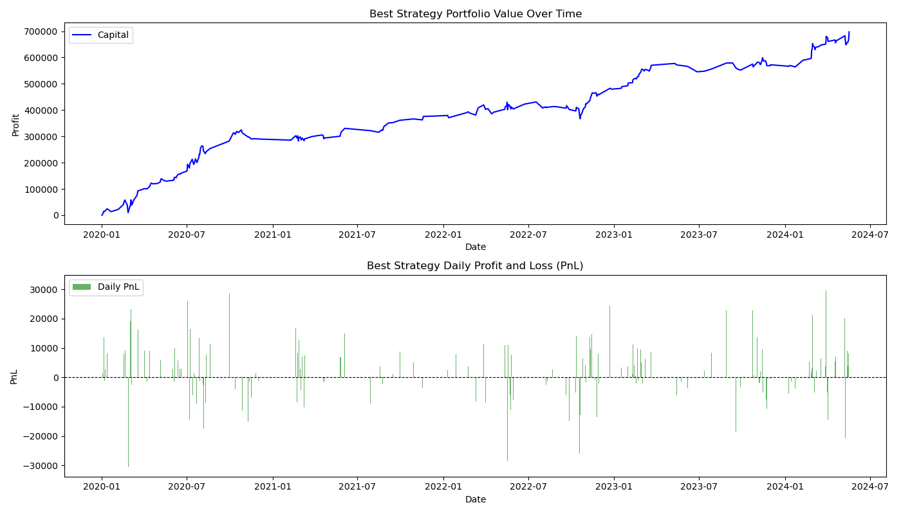

# QuantDev

ETF trading strategy develop based on pred

- 3.7: download data from bigquant platform

## Log
2025 jan to feb:

Best Sharpe Strategy: 
buy_threshold               500
buy_time         same_day_14:30
sell_time        next_day_10:00
sharpe_ratio           7.920859
max_drawdown           0.010843
winrate                    0.75
total_pnl          60418.622861
turnover               0.009654

2020.1 to 2024.6 (excluding october)

Best Sharpe Strategy:
buy_threshold               500
buy_time         same_day_14:30
sell_time        next_day_10:00
sharpe_ratio            3.75223
max_drawdown           0.045731
winrate                0.574627
total_pnl         697400.938959
turnover               0.215607

